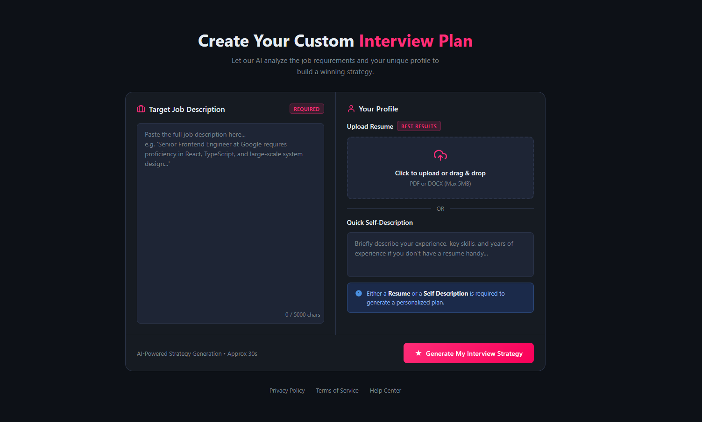
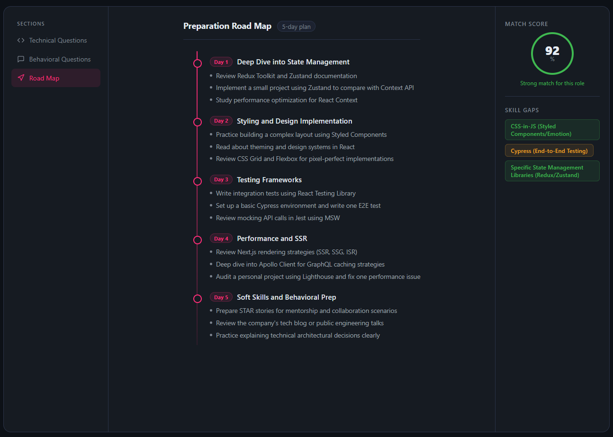
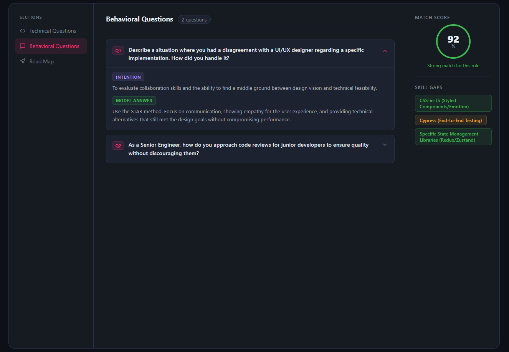
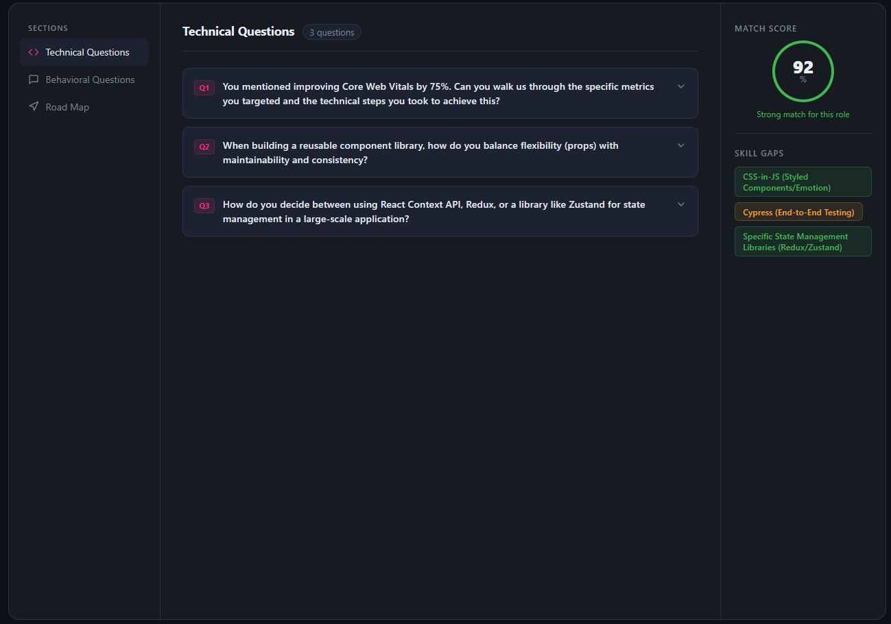
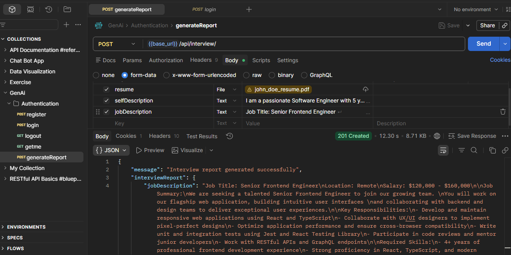

# 🎯 ResumeBuilder(Report Generator)

> A full-stack web application that generates personalized AI-powered interview preparation reports based on your resume, self-description, and target job description.

---

## 📸 Screenshots

### Home Page — `http://localhost:5173`


### Interview Report Technical Question Page — `http://localhost:5173/interview/abc`


### Interview Report Behavioral Question Page — `http://localhost:5173/interview/abc`


### Interview Report Roadmap Page— `http://localhost:5173/interview/abc`



---

## 🛠️ Tech Stack

| Layer | Technologies |
|-------|-------------|
| Backend | Node.js, Express, Multer, pdf-parse, Mongoose |
| Frontend | React, Axios, Custom Hooks (useAuth) |
| AI | AI service via `generateInterviewReport()` |
| Database | MongoDB via `interviewReportModel` |
| Auth | JWT via `authMiddleware` |

---

## ⚙️ Backend

### Controllers — `interviewController.js`

| Controller | Description |
|------------|-------------|
| `generateReportController` | Accepts resume PDF + `selfDescription` + `jobDescription`, parses PDF text, calls AI service, saves report to DB |
| `getReportByIdController` | Fetches a single report by `interviewId`, scoped to the logged-in user |
| `getAllReportsController` | Returns all reports for the user, sorted newest-first, with heavy fields excluded for performance |

#### PDF Parsing

Multer stores the uploaded PDF in memory (`req.file.buffer`). To extract text from it:

```js
const resumeContent = await (new pdfParse.PDFParse(Uint8Array.from(req.file.buffer))).getText()
```

> **Fix:** `pdfParse` is not directly callable as a function — it must be instantiated with `new pdfParse.PDFParse(...)`.

---

### Routes — `interviewRoutes.js`

| Method | Route | Description | Access |
|--------|-------|-------------|--------|
| `POST` | `/api/interview/` | Generate a new interview report (requires resume upload) | Private |
| `GET` | `/api/interview/report/:interviewId` | Get a specific report by ID | Private |
| `GET` | `/api/interview/` | Get all reports for the logged-in user | Private |

All routes are protected by `authMiddleware.authUser`.

---

### File Upload Middleware — `fileMiddleware.js`

Uses Multer with in-memory storage so uploaded PDFs never touch the filesystem:

```js
const upload = multer({
  storage: multer.memoryStorage(),
  limits: { fileSize: 5 * 1024 * 1024 } // 5 MB
})
```

---

## 🖥️ Frontend

### Home.jsx

- Displays existing interview report cards (summary view — heavy fields excluded)
- Quick navigation to generate a new report
- Shows user account information
- UI built with design inspiration from Google Stitch; hooks & state management done manually

### Auth Bug Fix

Two errors were occurring on page load:

```
401 Unauthorized — /api/auth/get-me
TypeError: Cannot read properties of undefined (reading 'user')
```

**Root cause:** The auth token was not being attached to outgoing requests.  
**Fix:** Ensured the token is included in request headers before calling `getMe()`, and added a null-check on the response before accessing `response.user`.

### interviewApi.js

Centralizes all interview-related API calls:
- Generate a new report
- Fetch a report by ID
- Fetch all reports for the logged-in user

---

## 🗄️ Schema Update

Added a missing required field to `interviewReportSchema`:

```js
title: {
  type: String,
  required: [true, "Job title is required"]
}
```

This stores the job title for display on report cards in the dashboard.

---

## 🚀 Getting Started

### Prerequisites
- Node.js
- MongoDB
- npm

### Installation

```bash
# Clone the repo
git clone https://github.com/your-username/ai-interview-prep.git
cd ai-interview-prep

# Install backend dependencies
cd backend
npm install

# Install frontend dependencies
cd ../frontend
npm install
```

### Running the App

```bash
# Start backend
cd backend
npm run dev

# Start frontend
cd frontend
npm run dev
```

Backend runs on `http://localhost:10000`  
Frontend runs on `http://localhost:5173`

---

## 📁 API Reference

### Generate Interview Report
```
POST /api/interview/
Content-Type: multipart/form-data
Authorization: Bearer <token>

Body:
  - resume        (file)    PDF resume
  - selfDescription (text)  Brief self-introduction
  - jobDescription  (text)  Target job description
```

### Get Report by ID
```
GET /api/interview/report/:interviewId
Authorization: Bearer <token>
```

### Get All Reports
```
GET /api/interview/
Authorization: Bearer <token>
```


## To upload the resume for now use postman
http://localhost:10000//api/interview/
image :- 
### To send the post request to the page

